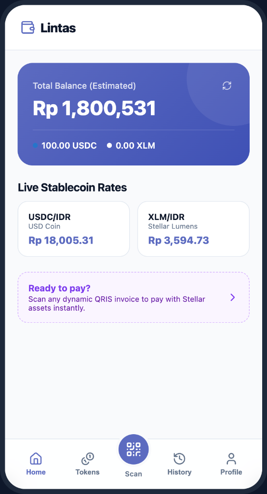

# Lintas



This project implements a bridge application that connects on-chain Stellar assets (USDC/XLM) to real-world Indonesian retail merchants using QRIS as the invoice format and Mayar for local payout and disbursement settlement.

---

## Architectural Approach (Approach A - Production Ready)

To settle payments to merchants without requiring complex, multi-billion IDR Penyelenggara Jasa Pembayaran (PJP) Kategori 1 licensing from Bank Indonesia (which would be required to pay dynamic QRIS rails directly), this bridge implements **Approach A**:

```
[User Wallet (Freighter)] 
       │ (Stellar USDC/XLM Payment)
       ▼
[Bridge Holding/Escrow Address]
       │ (On-Chain Detection)
       ▼
[Bridge Backend Engine]
       │ (Trigger Fiat Disbursement)
       ▼
[Mayar Checkout API / Payout] 
       │ (Real-Time IDR Settlement)
       ▼
[Merchant Bank Account / E-Wallet]
```

### Why this approach?
1. **Legal & Low Compliance Barrier**: Bypasses the need for a direct QRIS issuing/acquiring license.
2. **Direct Bank Settlement**: The merchant does not need to register on a crypto platform; they simply receive real Rupiah (IDR) in their existing bank account.
3. **Broad Compatibility**: Settles invoices parsed from any standard QRIS code (GoPay, ShopeePay, OVO, Bank-issued QRIS) by transferring the settled fiat to the merchant's account mapped to that invoice.

---

## Features & 5-Page Mobile Wallet Layout

Designed with a premium, mobile-first responsive wrapper, Lintas contains 5 pages/tab sections:
1. **Home**: Account balance overview (USDC/XLM/IDR estimates), faucet request button, and real-time exchange rates synced from CoinGecko.
2. **Activity**: Transaction history logs detailing on-chain payment hashes and statuses.
3. **Scan (Center Button)**: High-priority camera QRIS scanner and sandbox invoice payload generator.
4. **Merchant**: Settlement ledger dashboard tracking Mayar disbursement payloads.
5. **Profile**: Wallet connect settings (Freighter), network options, and key registry configuration.

---

## Technical Stack

* **Frontend**: React + Vite (TypeScript, Vanilla CSS)
* **Wallet Interop**: Freighter API + Stellar SDK
* **Payment Processor**: Mayar Invoice/Payout API (for easy testing & quick verification)
* **Network**: Stellar Testnet (simulating Mainnet transitions)

## Setup & Running

1. Copy `.env.example` to `.env` and fill in the required variables (including `VITE_MAYAR_API_KEY`).
2. Install dependencies:
   ```bash
   pnpm install
   ```
3. Run the development server:
   ```bash
   pnpm run dev
   ```

